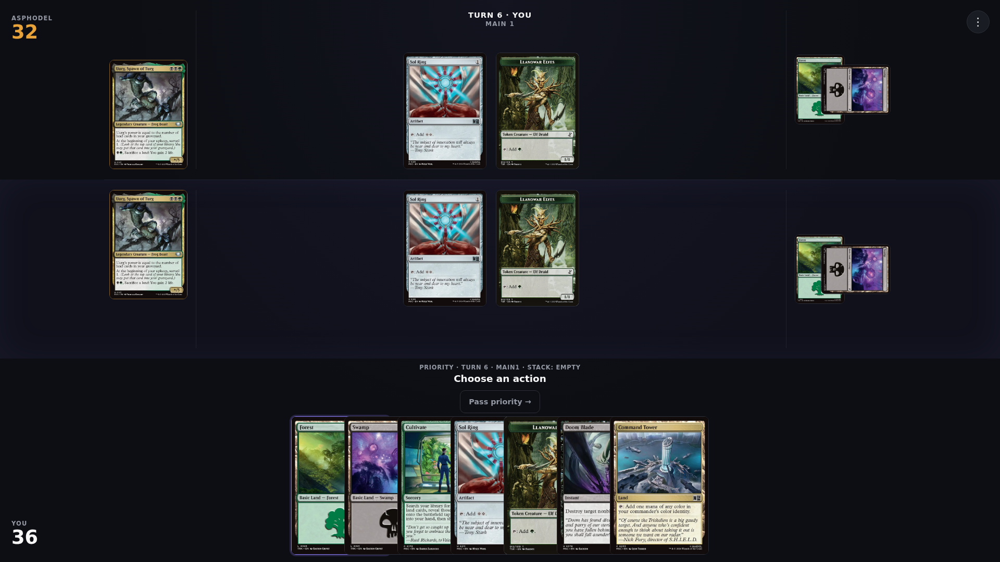
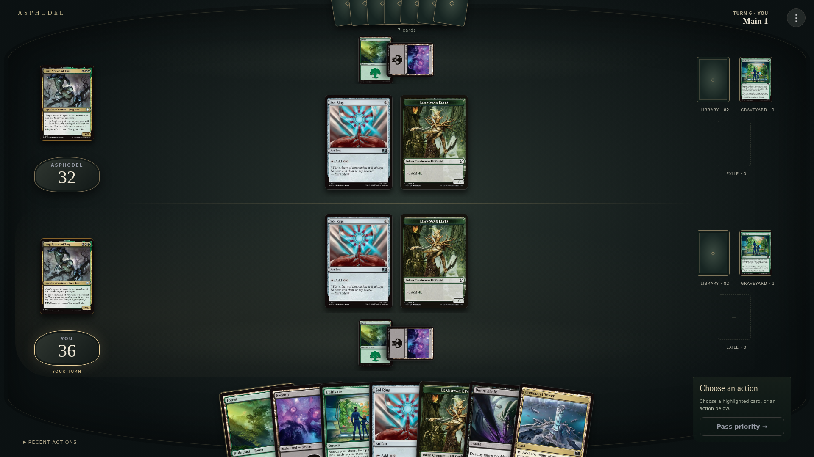

# V2e.7 — the obsidian table

## Design direction

The before capture revealed disconnected columns: life totals at the screen corners, commanders detached from those totals, lands isolated on the right, and a deep action band separating the hand from the table. The proposal is one dark green-black stone surface with aged brass inlay, an arced hand at its near edge, and player-owned seats. Card art provides the color; the environment supplies depth and ownership.




Both captures use the same isolated presentation fixture and real card presentation responses. They do not represent a live game or alter an existing playtest.

## Implementation

- Lands move behind each battle line. Life crests sit beneath command-zone cards and illuminate for the active player. Cards keep their aspect ratios; crowded battlefield rows scroll horizontally.
- Library backs, graveyard top cards and exile piles belong to each player. Public piles open a native dialog with Escape and focus handling. Library contents are never fetched. Opponent hand backs use only `handSize` (capped at 16 visual backs with the actual count alongside).
- The hand has an arc, overlapping cards and keyboard/hover elevation. It reconciles by exact cardRef. Large hands have a scrolling fallback.
- Simple decisions sit beside the hand, with a direct-card hint when mapped actions exist. More than five remaining choices or a value prompt gets a larger surface. Mana payment uses a low brass-edged surface and a lighter backdrop so confirmed taps remain visible.
- The public spell stack has a central presentation. Recent history is expandable and retains up to 60 played public events. Existing accepted event text is preserved.

`visual-transitions.ts` compares observations by gameRef, playerId and cardRef, then measures DOM positions around an authoritative paint. Known zone/controller moves use disposable Web Animations ghosts; new visible nodes settle in. Tap/untap remains a native transition, now with a representative-cardRef reconciliation key rather than a state-dependent grouping signature. Existing combat movement, life deltas and counter emphasis remain. Motion respects reduced-motion preferences and does not delay Forge or add timers to the view.

The public-zone renderer and transition model are player-ID based. The current layout still renders the existing two-player product; additional seat placement is future work, rather than a change to the observation or game protocol.

Hidden/face-down cards are explicitly excluded from presentation requests and rendered without faces, including public-zone inspection. Public inspection closes when the board changes so it cannot retain stale zone contents. Decisions continue to submit the supplied Forge choices verbatim. No backend, shared protocol, agent policy, report, or Forge changes.

## Restraint and follow-up

No particle effects, sound, copied game assets, artificial engine delays, or optimistic taps. Ambiguous arrivals are a settle animation, not a fabricated library-to-hand trajectory. A later pass should add authoritative draw provenance if exact draw paths are needed, art-led stack previews, richer turn-grouped history, and dedicated layouts for three/four seats. Very small screens currently retain a minimum-width table; a touch-specific composition deserves its own pass. Large board and hand scrolling is functional but would benefit from extended real-game stress testing.

## Validation

- Frontend: 112 tests passed, including five new transition/privacy tests; production build passed.
- Backend: 159 tests passed; TypeScript build passed.
- Browser fixture checks: 1920×1080 and 1366×768, public piles, native inspection/Escape, hand keyboard focus, F5 active-session resume, confirmed hand-to-land move, reduced motion, page overflow, and no page errors.
- `git diff --check` passed. Forge suite is not required: no shared protocol or Forge changes.

Reproduce the browser fixture against a running frontend/backend with Playwright available:

```sh
PLAYWRIGHT_MODULE=/absolute/path/to/playwright/index.mjs TABLETOP_URL=http://127.0.0.1:5174 node scripts/tabletop-visual-check.mjs
```

The harness intercepts playtest reads with synthetic human-safe observations; card presentation still uses the local backend. Screenshots go to `/tmp`. It never starts a real game or submits a choice.
